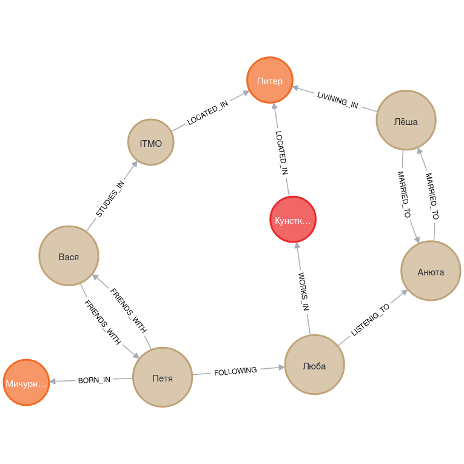

# Примеры запросов Cypher

Поработаем с модельным примером из первого занятия:

- Вася дружит с Петей
- Петя подписан на Любу
- Люба слушает Анюту
- Анюта замужем за Лёшей
- Лёша живёт в Питере
- Вася учится в ИТМО
- Петя родился в Мичуринске
- Люба работает Кунсткамере
- ...

(Полное описание модельного примера смотри в слайдах к теме
[Графовая модель данных](slides-graph-data-model.pdf)).

После выполнения запросов мы должны получить вот такой граф:



Посмотрим для начала текущий граф в базе:

``` cypher
match (n) return n
```

Можем сначала удалить весь текущий граф:

``` cypher
match (n) detach delete (n)
```

## Наполнение графа связями и узлами

- Добавим узел для Васи:

``` cypher
create ({name: "Вася"})
```

- Добавим остальных людей скопом:

``` cypher
foreach (name in ["Петя", "Люба", "Анюта", "Лёша"] | create (:Person {name: name}))
```

- Назначим Васе метку Person как и у остальных людей:

``` cypher
match (n) where n.name = "Вася" set n:Person
```

- "Вася дружит с Петей":

``` cypher
match (v {name: "Вася"}) match (p {name: "Петя"})
create (v)-[:FRIENDS_WITH]->(p), (p)-[:FRIENDS_WITH]->(v)
```

- "Петя подписан на Любу":

``` cypher
match (p {name: "Петя"}) match (l {name: "Люба"}) create (p)-[:FOLLOWING]->(l)
```

- "Люба слушает Анюту":

``` cypher
match (l {name: "Люба"}) match (a {name: "Анюта"}) create (l)-[:LISTENIG_TO]-(a)
```

- "Анюта замужем за Лёшей":

``` cypher
match (l {name: "Анюта"}) match (a {name: "Лёша"}) create (l)-[:MARRIED_TO]->(a), (a)-[:MARRIED_TO]->(l)
```

- "Лёша живёт в Питере":

``` cypher
match (l {name: "Лёша"}) create (p:City {name: "Питер"}), (l)-[:LIVINING_IN]->(p)
```

- "Вася учится в ИТМО":

``` cypher
match (v {name: "Вася"}) match (p {name: "Питер"})
create (itmo:University:Organization {title: "ITMO"}), (v)-[:STUDIES_IN]->(itmo), (itmo)-[:LOCATED_IN]->(p)
```

- "Петя родился в Мичуринске":

``` cypher
match (p) where p.name = "Петя" create (m:City {name: "Мичуринск"}), (p)-[:BORN_IN]->(m)
```

- "Люба работает Кунсткамере":

``` cypher
match (l {name: "Люба"}) match (p {name: "Питер"})
create (c:Museum:Organization {title: "Кунсткамера"}), (c)-[:LOCATED_IN]->(p), (l)-[:WORKS_IN]->(c)
```

## Удаление узлов и связей

- Удаление связей:

``` cypher
match (p)-[r:FRIENDS_WITH]->(v) delete r
```

- Удаление узлов:

``` cypher
match (p:Robot {name: "R2-D2"}) delete p
```

## Дубликаты и ограничения

Типичная ошибка -- добавление дубликатов узлов и связей.

Зададим ограничение на повторяемость имён людей:

``` cypher
create constraint unique_name_of_person for (p:Person) require p.name is unique
```

Попробуем добавить Васю ещё раз:

``` cypher
create (:Person {name: "Вася"})
```

Получим сообщение об ошибке:

```
Node(0) already exists with label `Person` and property `name` = 'Вася'
```

Нет простого способа удалить дубликаты. Можно поступить так:
- визуализировать граф и посмотреть, какие узлы с их связями можно смело удалить:
- удалить все, кроме первых по созданию

Собственно, так как узлы одинаковы во всём, кроме их идентификаторов,
то используем для удаления именно идентификатор узла
(функция `id` возвращает числовой идентификатор узла или связи):

``` cypher
match (p {name: "Питер"}) where id(p) = 9 detach delete p
```

Посмотрим все ограничения:

``` cypher
show unique constraints
```

Удалим ограничение:

``` cypher
drop constraint unique_name_of_person
```

(c) Симоненко Евгений, 2022
